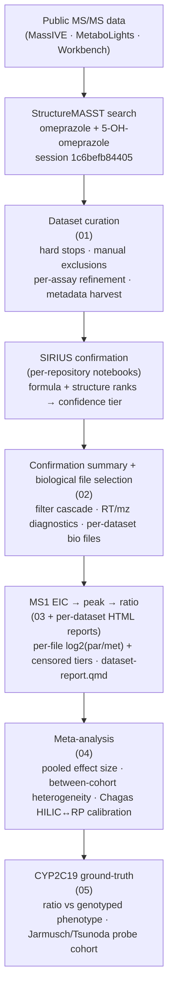

# Reverse Metabolomics — Omeprazole / 5-hydroxyomeprazole

A reproducible end-to-end **workflow for public-data reanalysis at
scale**, built on the
[RforMassSpectrometry](https://www.rformassspectrometry.org/)
ecosystem. The worked example mines the omeprazole /
5-hydroxyomeprazole parent–metabolite pair across public LC-MS/MS
metabolomics deposits as a population-scale read-out of **CYP2C19
metaboliser activity**.

---

## What this is

This repo serves two intertwined purposes — please read it as either,
or both:

**1. A methods showcase.** The workflow demonstrates how
[`RuSirius`](https://github.com/RforMassSpectrometry/RuSirius),
[`Chromatograms`](https://www.bioconductor.org/packages/Chromatograms/),
and the Bioconductor MS backends
([`MsBackendMassIVE`](https://www.bioconductor.org/packages/MsBackendMassIVE/),
[`MsBackendMetaboLights`](https://www.bioconductor.org/packages/MsBackendMetaboLights/),
[`MsBackendMetabolomicsWorkbench`](https://www.bioconductor.org/packages/MsBackendMetabolomicsWorkbench/))
compose into a turnkey pipeline that:

- harmonises sample-level metadata across three repository schemas
  (Pan-ReDU, ISA-Tab, mwTab) with an auditable trail (`01`);
- runs SIRIUS-based formula/structure confirmation at scale via
  `RuSirius` against StructureMASST hits, per-repository (the three
  confirmation notebooks);
- extracts targeted EICs with `Chromatograms::chromExtract()` in a
  single pass over a `Spectra` object, computes peak metrics with
  `MsQuality`, and produces a uniform per-file readout
  (`detection_tier`, `log2_ratio`, FWHM-outlier flag) across every
  dataset (`dataset-report.qmd`, `03`);
- supports per-dataset within-study contrasts now and is structured
  to accept a future cross-dataset meta-analysis layer (`04`).

The pipeline is designed to be lifted onto **any
parent–metabolite-pair question** that public MS/MS data can address —
swap the StructureMASST query and the constants, and the rest of the
workflow follows.

### Why MS1 propagation, and not MS2 alone

This is the pipeline's central methodological claim.

These deposits are acquired by **data-dependent acquisition (DDA)**: the
instrument decides *during the run* which ions to fragment, choosing
mostly by intensity, within a limited duty cycle. A compound can be
present at a perfectly measurable level and receive **no MS2 scan at
all**, simply because the instrument was busy elsewhere. So an MS2-only
search (MASST and relatives) cannot distinguish *"the compound is
absent"* from *"the compound is present but was never fragmented"* — and
because selection is intensity-driven, the misses are biased toward the
**low-abundance** cases, which is exactly the incidentally-dosed subject
this project is looking for. **MS2-only prevalence is a biased lower
bound.**

The two levels are complementary: **MS2 gives identity** (fragments
constrain the structure, and can separate isomers); **MS1 gives
coverage** (recorded continuously, for everything, with no selection
step). Propagation uses MS2 *once* to pin the mass and retention time,
then measures at MS1 in **every** file — including the many where the
instrument never fragmented the compound.

**This has a direct precedent in proteomics: *match-between-runs*.**
Popularised by MaxQuant and now routine, MBR identifies a peptide by MS2
in the run where it happened to be fragmented, then transfers that
identification to other runs by accurate mass and aligned retention
time, quantifying at MS1 where the precursor was never selected.
Proteomics adopted it precisely because DDA under-samples in the way
described above. **Metabolomics repository reanalysis has largely not
adopted the equivalent step** — that gap is what this pipeline fills.

Two consequences worth stating plainly:

- **It makes cross-repository comparison legitimate, not just larger.**
  Comparing deposits by MS2 detection rate substantially compares
  *instruments and acquisition settings* (a deeper precursor list
  fragments more, so it "detects" more). MS1 is acquired the same way
  regardless, so propagation removes that confound.
- **It trades specificity for sensitivity, and that cost is real.** MS2
  separates compounds sharing a mass; MS1 cannot. Propagation extends
  coverage only as far as chromatography preserves identity — see the
  isobaric-interference discussion in `03`, where an exact isomer of the
  metabolite (omeprazole sulfone, the CYP3A4 product) silently
  substitutes for the target if the retention-time window is too wide.

**2. A biological question.** Omeprazole is a proton-pump inhibitor
cleared primarily by hepatic CYP2C19. Administered as a racemic
mixture, (R-S)-omeprazole undergoes stereoselective metabolism: (R)-5-
hydroxyomeprazole is produced via CYP2C19/CYP3A and (S)-5-
hydroxyomeprazole via CYP2C19. CYP2C19 is estimated to metabolise
~15% of all marketed drugs — proton-pump inhibitors, antiplatelet
agents, antidepressants, beta-blockers, benzodiazepines and many
others ([Tornio & Backman 2018](https://onlinelibrary.wiley.com/doi/full/10.1111/bcpt.14095)).
The *ratio* of parent to metabolite in plasma, serum, or urine is a
long-standing proxy for an individual's CYP2C19 phenotype (poor /
intermediate / extensive / ultra-rapid metaboliser), and the phenotype
distribution varies strikingly by ancestry. Conventional studies
measure that ratio in dedicated pharmacology cohorts with controlled
dosing.

This project asks the inverse question:

> **Wherever omeprazole and 5-OH-omeprazole *both* happen to show up
> in a public metabolomics deposit — even when the deposit was
> collected for an unrelated study — what does the ratio look like,
> and how does it vary across populations and conditions?**

The novel piece is the *reverse* design: rather than reporting where a
compound is detected (the usual MASST/Pan-ReDU output), the pipeline
quantifies how the parent–metabolite balance shifts across cohorts.
That balance is a CYP2C19 activity signal we can extract for free from
data that was never collected with pharmacogenomics in mind.

**Extending it.** The workflow generalises to any
substrate–metabolite pair where SIRIUS can confirm both endpoints.
A second probe pair (e.g. dextromethorphan / dextrorphan for CYP2D6)
would demonstrate the cross-enzyme reach. Working title for the
manuscript: *"Quantitative post-MASST reverse metabolomics enables
pharmacoepidemiology of CYP2C19 activity across public repositories."*

---

## How it works



| stage | qmd | what it produces |
|---|---|---|
| 1 | `01-masst-curation.qmd` | `hits_curated.csv` (every MASST hit in a kept dataset); `dataset_metadata_table.csv` (one row per kept dataset, canonical-field mappings + paper-derived constants) |
| 2 | `confirmation/massIVE-hit-confirmation.qmd` · `confirmation/metaboLights-confirmation.qmd` · `confirmation/metabolomics-workbench-confirmation.qmd` → `02-confirmation-and-bio-files.qmd` | SIRIUS-confirmed features (filtered, RT/mz diagnostics) and per-dataset biological file lists |
| 3 | `03-all-datasets.qmd` (cross-dataset loop, cross-dataset summary) and `dataset-report.qmd` (per-dataset HTML deep dive — extraction config, EIC overlays, peak detection, "Neither" inspection, FWHM outliers, PCA, detection tiers, within-study stats; rendered from `03` with `-P render_reports:true`) | per-file `detection_tier` + `log2_ratio`, per-dataset within-stats, per-dataset HTML reports |
| 4 | `04-cyp-validation.qmd` | the omeprazole / 5-OH ratio against the genotyped CYP2C19 phenotype in the Jarmusch/Tsunoda probe cohort (ground-truth check that licenses the corpus expansion) |
| 5 | `05-meta-analysis.qmd` | Part A: MS2 → MS1 detection-rate (prevalence) expansion per cohort, presence-based so isomer-immune, plus the per-deposit contrast scan under the analysis-unit rule. Part B: the quantitative strand and its limits — the per-deposit offset is mostly matrix rather than instrument, and no ratio contrast survives FDR anywhere. |

---

## Current state

> [!NOTE]
> **Headline results (settled 2026-08-03).** The story is *validate then
> expand*: reproduce the probe study's ratio at MS1, validate it against the
> genotype the authors never tested (`04`), then demonstrate corpus-scale
> propagation (`05`).
> - **CYP2C19 validation** — the per-subject **AUC** of parent/metabolite over
>   the dosing interval tracks genotyped phenotype at **Spearman ρ = −0.756,
>   p = 0.0018** (MSV000084008 plasma, 14 subjects), monotonic across all five
>   phenotype classes and robust to leave-one-subject-out (all p ≤ 0.0063).
>   The earlier single-timepoint ratio on the *same* data gave p = 0.51;
>   integrating to an AUC is the entire difference. Genotype is external to the
>   mass spec, and the AUC is built mostly from MS1-propagated peaks — so this
>   is a genuine validation of the pipeline. Limits: n = 14, one cohort, three
>   classes have a single subject.
> - **MS1 propagation gain** — measured against the MASST MS2 baseline over the same
>   4,668 metadata-carrying files (`05` Part A): omeprazole **280 → 526 (×1.88)**,
>   5-OH **367 → 542 (×1.48)**, and files supporting a **usable ratio 223 → 470
>   (×2.11)**. The gain is largest where DDA under-sampled (MSV000094097 gains its
>   first usable ratio, 0 → 18) and smallest in the dosed cohort, where fragmentation
>   already caught nearly everything. No deposit now goes backwards. **Do not quote
>   the old "159 seeds → 626 (×3.9)"** (two different denominators) or the
>   "436 → 666 / 519 → 732" pair, which predates the uncapped confirmation.
> - **Propagation controls** — the **positive control re-detects 768 of 771**
>   extracted files carrying a SIRIUS-confirmed spectrum (parent 338/338, metabolite
>   430/433), and the **negative control is empty**: 0 of 49 pre-dose plasma draws,
>   and 0 of 49 at five minutes. **Synthetic decoys were dropped** — in an untargeted
>   file a real compound can sit at the decoy mass, so a hit there bounds the
>   false-positive rate from above without estimating it. Never quote the old
>   "0 of 30,042" decoy numbers.
>
> The **isobaric-interference** problem that once inverted the ratio is fixed.
> The metabolite RT window admitted **omeprazole sulfone** (`C17H19N3O4S`,
> m/z 362.1169, a CYP3A4 product) until the window was tightened to
> `RT_PAD_S = 5`; the whole corpus was re-extracted at that setting. MS2
> separates the isomers, so curation (`01`) and SIRIUS confirmation are
> unaffected; the presence/gain results rest on the parent, which has no
> isobaric twin.
>
> A rendered summary deck lives in `deck/reverse-met-pipeline-results.pptx`
> (regenerate with `python deck/build_deck.py`); per-stage timing is in
> `docs/pipeline-timing.md` (both `deck/` and `docs/` are local, git-ignored).

| | |
|---|---|
| FASSTrecords extraction | DOI 10.5281/zenodo.18199544 · 128 datasets with a hit · **44 with both compounds** |
| After curation (`01`) | **15 (deposit, assay) entities** kept; 9,243 MASST hits carried forward; spanning UK, Italy, China, India, USA, Venezuela |
| Excluded with audit trail | dropped deposits categorised as `no_or_limited_metadata`, `access_restricted`, `dia`, `in_vitro`, `non_human`, `reference_material`, or `no_assay_with_both_roles` (see `other_exclusions` in `01`) |
| After SIRIUS confirmation (`02`) | **12 datasets** survive; 7,201 confirmed features after uncapping SIRIUS (the earlier 241 was a per-role cap, not a limit of the data). MSV000086975 and MSV000085256 rejected: SIRIUS calls their spectra fluorinated, sulfur-free formulas (e.g. `C17H16FN3O4`, `C14H16F3N4O3`), not omeprazole. Working as intended. |
| All-datasets loop (`03`) | runs the per-dataset EIC → peak → ratio pipeline across every confirmed dataset; writes the deduped `sample_table_all.csv`, and the per-file `sample_table_perfile.csv`. Per-dataset detail lives in one HTML per dataset, rendered from `dataset-report.qmd` by re-rendering `03` with `-P render_reports:true` |
| CYP2C19 ground-truth (`04`) | **validated.** The probe cohort (Jarmusch/Tsunoda, PMC7485946) is a two-period crossover in 14 healthy subjects dosed a CYP probe cocktail on days 1 and 9 with cefprozil in between; omeprazole is its CYP2C19 probe. Reconstructing the **per-subject AUC** of parent/metabolite across the serial PK timepoints (recovered from the submitter metadata) and correlating it against the genotyped phenotype gives **ρ = −0.756, p = 0.0018**, monotonic across all five phenotype classes, robust to leave-one-out (all p ≤ 0.0063). The genotype is external to the mass spec and the AUC is built mostly from MS1-propagated peaks, so this validates the pipeline end-to-end. The single-timepoint ratio on the same data was null (p = 0.51) — the AUC is what makes it work. Limits: n = 14, one cohort, and three phenotype classes (Poor / Rapid / Ultrarapid) have a single subject each, so it is a strong proof-of-concept, not a powered epidemiological result. |
| Meta-analysis (`05`) | Part A expands the classic reverse-metabolomics prevalence analysis (MS2 vs MS1 detection rate per compound per cohort, presence-based so isomer-immune) and adds the per-deposit contrast scan: propagation takes testable contrasts 33 → 48 and survivors at FDR 0.05 from 5 → 11, losing none. Part B is the quantitative strand: no ratio contrast survives FDR in any deposit, and the variance decomposition shows the cross-deposit offset is body site (37.9%) far more than study (2.9%). It deliberately does not pool an absolute ratio into one estimate. |

The audit trail for every curation decision is in git: the
`other_exclusions` tibble in `01`, the inline citation comments on
each `constants` entry, the Pan-ReDU TSVs auto-cached under
`dataset_metadata/`, and the dated StructureMASST exports under
`StructureMASST_output/`.

---

## Running it

1. **Install dependencies** (Bioc + GitHub; see [Dependencies](#dependencies) below).
2. **Open the project** in RStudio (or any working dir with R ≥ 4.5).
3. **Render qmds in order**: `01` → 3 confirmation notebooks (any order) → `02` → `03` → `04` → `05`. For the per-dataset HTMLs, re-render `03` with `-P render_reports:true`.

```r
quarto::quarto_render("01-masst-curation.qmd")
# ... confirmation notebooks ...
quarto::quarto_render("02-confirmation-and-bio-files.qmd")
quarto::quarto_render("03-all-datasets.qmd")
# quarto render 03-all-datasets.qmd -P render_reports:true   # per-dataset HTMLs
quarto::quarto_render("04-cyp-validation.qmd")   # validate on the ground-truth cohort
quarto::quarto_render("05-meta-analysis.qmd")    # then expand across the corpus
```

The first render of `01` will auto-fetch MTBLS / ST / Pan-ReDU
metadata into `dataset_metadata/`. The first render of `03` will sync
the actual mzML files via the relevant `*_sync_data_files()` backend
(large; allow time + disk).

`check-versions.R` (at the repo root) is sourced from the top of `01`
and fails fast if any package or the SIRIUS binary is off-version.

---

## Appendix A · Repository layout

### qmd documents

The pipeline documents in execution order:

| document | description | reads | writes |
|---|---|---|---|
| `01-masst-curation.qmd` | FASSTrecords discovery (skips without the DB), load MASST exports, hard-stop + manual exclusion, per-assay refinement, harvest tech + biological metadata | FASSTrecords DB (optional), `StructureMASST_output/*.csv`, `dataset_metadata/*` | `StructureMASST_output/fasstrecords_hits.csv` (discovery), `artifacts/hits_curated.csv`, `artifacts/dataset_metadata_table.csv` |
| `confirmation/massIVE-hit-confirmation.qmd` | SIRIUS confirmation for MassIVE datasets | `artifacts/hits_curated.csv`, `sirius_projects/MSV*/` | `artifacts/hits-confirmed-massive.csv`, `results/MSV*/` |
| `confirmation/metaboLights-confirmation.qmd` | SIRIUS confirmation for MetaboLights datasets | `artifacts/hits_curated.csv`, `sirius_projects/MTBLS*/` | `artifacts/hits-confirmed-metaboLights.csv`, `results/MTBLS*/` |
| `confirmation/metabolomics-workbench-confirmation.qmd` | SIRIUS confirmation for Workbench datasets | `artifacts/hits_curated.csv`, `sirius_projects/ST*/` | `artifacts/hits-confirmed-metabolomics-workbench.csv`, `results/ST*/` |
| `02-confirmation-and-bio-files.qmd` | Combine confirmed features, filter cascade, RT/m/z diagnostics, per-repository biological file selection | `artifacts/hits-confirmed-*.csv`, `artifacts/dataset_metadata_table.csv`, `dataset_metadata/` | `artifacts/hits-confirmed-all.csv`, `artifacts/datasets-confirmed.csv`, `artifacts/bio_files_per_ds.rds`, `artifacts/bio_assays_per_ds.rds` |
| `03-all-datasets.qmd` | Per-dataset EIC → peak → ratio pipeline, looped over every kept dataset; cross-dataset summary plots | `artifacts/*.csv`, `artifacts/*.rds` | `artifacts/sample_table_all.csv`, `artifacts/sample_table_perfile.csv` (per-dataset caches already written under `artifacts/per_dataset/` by the extraction step) |
| `dataset-report.qmd` (parameterised template; rendered once per dataset by `03` when `render_reports:true`) | Per-dataset deep dive HTML — extraction config, EIC overlays, peak detection + positive-control check, "Neither" EIC inspection, FWHM outliers, PCA, detection-tier breakdown, within-study stratifier stats | `artifacts/per_dataset/<dataset_id>.rds` | `reports/report-<dataset_id>.html` |
| `04-cyp-validation.qmd` | CYP2C19 ground-truth: omeprazole / 5-OH ratio vs the genotyped phenotype in the Jarmusch/Tsunoda probe cohort (stem-join to the genotype table); file- and subject-level tests, plasma vs non-plasma | `artifacts/rescue_samples.csv`, `artifacts/per_dataset/*.rds` | figures + tables (inline) |
| `05-meta-analysis.qmd` | Part A: per-file MS2 vs MS1 detection prevalence per compound per cohort (presence-based, isomer-immune) and the per-deposit contrast scan. Part B: the quantitative strand and its limits; duplicate/collision audit; Chagas HILIC↔RP paired look (underpowered, deliberately not tested). Absolute-ratio pooling is described, not run | `artifacts/sample_table_all.csv`, `artifacts/sample_table_perfile.csv`, `artifacts/hits_curated.csv`, `artifacts/datasets-confirmed.csv` | `artifacts/meta_effects.csv`, plots |

### R helper library

Reusable functions extracted from the qmds; each qmd sources only the
files it needs.

| file | contents |
|---|---|
| `R/_setup.R` | `library()` calls for all packages; creates `artifacts/` |
| `R/masst.R` | `infer_adduct()`, `ADDUCT_CANDIDATES`; `compound_spec` + `role_formula` (the probe pair — swap here for another parent/metabolite pair) and `PHENO`, the CYP2C19 activity order the validation regresses on |
| `R/metadata.R` | metadata reconciliation + file selection: `fetch_panredu_metadata()`, `msv_native_sample_table()` (full outer join of Pan-ReDU + submitter, validated against `massive_list_files()`), `norm_file_key()` / `to_bare_name()` (cross-source name matching), `load_metadata()`, `select_bio_files_massive()`, `is_missing_val()` |
| `R/ms1.R` | MS1 pipeline: `load_spectra_ms1()`, `derive_extraction_config()`, `extract_eics()`, the peak picker (`pick()`, `detected_new()`, `new_win()`, `is_dropped()`), `process_eics()`, `build_sample_table()`, `run_ms1_for_dataset()`, `count_peaks()`, `flag_fwhm()`, `within_dataset_stats()`, `plot_fwhm_outliers()`; and `ablation_setup()` / `ablation_variant()` / `ablation_isobars()`, which re-run the extraction from the cached EICs with one choice changed so `03` can price each decision |
| `R/peak_review_panels.R` | manual-audit tool (run standalone): re-picks from the cached wide EICs and writes per-dataset review panels + the single-threaded extraction-timing log `peaks_review_v2/_extract_times.csv` that `03`'s runtime table reads |

### bench/

Operational tooling only. Every analysis lives in the notebooks.

| script | what it answers |
|---|---|
| `bench/rerun.sh` | re-render the five notebooks in order, logging each to `bench/rerun-<name>.log` |
| `bench/time-pipeline.sh`, `bench/timing-report.R` | wall-clock timing of a full re-run, for `docs/pipeline-timing.md` |

### artifacts/

All intermediate files go here; nothing writes to the repo root.

| file | produced by | consumed by |
|---|---|---|
| `hits_curated.csv` | `01` | confirmation notebooks |
| `dataset_metadata_table.csv` | `01` | `02`, `03` (via `load_metadata()`) |
| `assay_metadata.csv` | `01` (per-(dataset, assay) tech harvest) | `02` (joined onto confirmed features) |
| `hits-confirmed-{massive,metaboLights,metabolomics-workbench}.csv` | confirmation notebooks | `02` |
| `hits-confirmed-all.csv` | `02` | `03` |
| `datasets-confirmed.csv` | `02` | `03`, `04` |
| `bio_files_per_ds.rds` | `02` | `03` |
| `bio_assays_per_ds.rds` | `02` | `03` |
| `sample_table_all.csv` | `03` | `04` |
| `per_dataset/<dataset_id>.rds` | extraction step | `dataset-report.qmd`, `05` |
| `isobar_fragment_check.csv` | `03` (cached; it reads raw MS2 and takes ~10 min, so delete it to force a recompute) | `03` |

### curation/

Hand-authored MS1 peak-review decisions — the only manual inputs to the
extraction, and the sole tracked content under this heading:

| file | what it records |
|---|---|
| `curation/ms1_drop_list.csv` | peaks the manual audit rejected, keyed by (dataset, role, file), each with a stated reason |
| `curation/rt_apex_overrides.csv` | manual RT-apex corrections where the automatic MS1 snap was unreliable |

Read by `R/ms1.R` (extraction) and `R/peak_review_panels.R` (audit panels).

### dataset_metadata/

Flat directory of cached native metadata files — **git-ignored** (regenerated by
`01-masst-curation.qmd` + `R/metadata.R` from pinned sources; a fresh clone re-fetches
them, so nothing here is committed). Patterns + sources:

| pattern | source | how it gets cached |
|---|---|---|
| `MSV*_metadata.{tsv,csv}` | MassIVE deposit (submitter-supplied) | downloaded / pinned-fetched (082493, 084008 via `01-masst-curation.qmd`); cached on disk, git-ignored |
| `MSV*_panredu.tsv` | GNPS2 Pan-ReDU | auto-fetched by `fetch_panredu_metadata()` from `https://redu.gnps2.org/...`; cached locally |
| `MTBLS*_i_Investigation.txt` | MetaboLights ISA-Tab | auto-fetched from EBI FTP on first `mtbls_inv_assay_names()` call |
| `a_MTBLS*_*.txt` | MetaboLights ISA-Tab assay file | auto-fetched on first `fetch_assay_table()` call |
| `s_MTBLS*.txt` | MetaboLights ISA-Tab sample file | manually downloaded; bio-metadata reached at render time via `mtbls_sample_data()` (online) |
| `ST*_AN*.txt` | Workbench mwTab analysis file | manually downloaded; bio + tech metadata reached at render time via `mwb_metadata()` (online) |

**Two-source policy for MassIVE deposits.** Pan-ReDU is treated as the
**authoritative source for which files actually exist** on the MassIVE
server and is consulted **first**. The submitter TSV (when present) is
joined on top via case-insensitive filename stem to gap-fill columns
Pan-ReDU lacks. ReDU/MIxS missing-value placeholders (`"missing value"`,
`"not applicable"`, …) are filtered everywhere via the shared
`is_missing_val()` helper. The rationale and audit findings that drove
this policy live in **Appendix C** below.

### results/ and sirius_projects/

```
sirius_projects/<dataset_id>/{parent,metabolite}/<role>.sirius   # input to confirmation
results/<dataset_id>/{hits_rt,parent_results,metabolite_results}.csv   # SIRIUS output, read by 02
```

### StructureMASST_output/

`fasstrecords_hits.csv` — the current hit set, written by the FASSTrecords
discovery chunk in `01-masst-curation.qmd` (skipped unless the DB is present),
version-controlled. The
superseded manual GNPS2 web exports (dated CSVs + PDF screenshots) are kept
locally under `_archive_webexport/` but are not tracked.

---

## Appendix B · Key concepts

**Confidence tiers** (SIRIUS, per confirmed feature; rules from each confirmation QMD):

| tier | rule |
|---|---|
| **strict** | formula rank 1 AND structure rank 1 |
| **standard** | formula rank ≤ 3 AND structure rank ≤ 5 |
| **liberal** | formula rank ≤ 15 AND structure rank ≤ 15 |
| **not_confirmed** | beyond liberal — dropped before `hits-confirmed-*.csv` |

All three confirmed tiers flow through to `02` and are preserved in
`hits-confirmed-all.csv`; the `confidence` column lets downstream code
stratify or weight by tier in the meta-analysis layer.

**Detection tiers** (per sample, in the ratio analysis):

| tier | parent peak | metabolite peak | ratio |
|---|---|---|---|
| `both` | yes | yes | numeric `log2(par/met)` |
| `parent_only` | yes | no | right-censored (extensive-metaboliser absent) |
| `metab_only` | no | yes | left-censored (poor-metaboliser absent) |
| `neither` | no | no | sample contributes nothing |

The Fisher tests in `within_dataset_stats()` use `parent_only` and
`metab_only` as detected for the relevant role (no imputation, no
forced-ratio fallback). The Kruskal-Wallis ratio test uses `both`
only. Proper joint modelling of the censored cases is the
meta-analysis layer's job.

**Exclusion vocabulary** (in `other_exclusions` in `01`):

| reason | meaning |
|---|---|
| `no_or_limited_metadata` | no usable biological metadata anywhere (deposit + Pan-ReDU + publication), or only a single value for every stratifier |
| `access_restricted` | demographics gated behind a controlled-access portal (e.g. NCRAD); only body_site / country recoverable |
| `dia` | DIA acquisition — single-scan MASST matching unreliable |
| `in_vitro` | cell culture / standards-only deposit |
| `no_assay_with_both_roles` | parent and metabolite hits land in different assays of the same deposit (per-assay refinement in `01`) |

Datasets dropped at SIRIUS confirmation (`02`) are not in this list —
they appear in `hits_curated.csv` but get filtered out by the
"both roles confirmed" filter. MSV000085256 is the only such case in
the current corpus.

---

## Appendix C · Metadata-source clarity and the two-source reconciliation policy

> [!IMPORTANT]
> **Policy update (2026-07-21) — Pan-ReDU is *not* authoritative for which
> files exist.** The material below documents real, still-valid findings
> (extension mismatches, phantom submitter filenames, partial submitter
> coverage), but its central conclusion — *"Pan-ReDU always matches what's
> actually on MassIVE"* — was **wrong in the other direction too**: Pan-ReDU
> also **under-covers** deposits. On MSV000082493 it indexed 690 files and
> **missed the entire 341-file blood collection** (added in a later deposit
> update) together with that deposit's CYP2C19 genotype/phenotype columns —
> the matrix the whole validation depends on.
>
> The reconciliation policy is now:
> 1. **Full outer join** of Pan-ReDU and the submitter table (not Pan-ReDU as
>    base with the submitter gap-filling), so a file described by *either*
>    source is a candidate.
> 2. **Validate existence against the deposit's own inventory**
>    (`massive_list_files()`), which is the real authority — this keeps the
>    phantom-file protection that Pan-ReDU was standing in for.
> 3. **Admit a submitter-only file only if it carries enough metadata**
>    (≥ 2 canonical fields), and **QC/blank/standard removal is driven by the
>    declared sample-type column** (`SampleType` *or* `MS_SampleType`), never
>    by file names.
> 4. **De-duplicate on `(chromatography, file name)`, matched with
>    `norm_file_key()`** — because two deposits can share file names either
>    because they are the *same study* (MSV000082493 + MSV000084008: one study
>    under two accessions, 333 shared plasma files, same 14 subjects — collapse
>    them) or because they are a *collision* (MSV000092754 HILIC vs
>    MSV000092757 RP: same names, different data — keep apart). Only comparing
>    extracted values tells the two cases apart. See
>    `msv_native_sample_table()` and the "One study, two accessions" section of
>    `04`.
>
> That a public-data pipeline must reconcile three independent, individually
> incomplete things — spectral hits, the file inventory, and every metadata
> source — is itself a reportable finding, separate from the MS1-recovery
> claim.

A non-trivial portion of the engineering effort in `01` and `02` is
about **reconciling inconsistent metadata sources** across MassIVE
deposits. The findings here are worth preserving because they
generalise — any future post-MASST reanalysis on public data will run
into the same class of issue, and the manuscript-level argument for
**Pan-ReDU as a curation layer** rests on this empirical experience.

### Why this matters

MassIVE deposits ship with a submitter-supplied metadata TSV/CSV.
[Pan-ReDU](https://redu.gnps2.org/) re-harmonises that submitter data
against ReDU/MIxS controlled vocabularies, fills in standardised
canonical columns (`SampleType`, `SubjectIdentifierAsRecorded`,
`HealthStatus`, etc.), and crucially **re-indexes against the file
tree actually present on MassIVE**. Both sources are downloaded into
`dataset_metadata/` and consulted, but they disagree in non-obvious
ways that materially affect what files you sync and what biology you
can recover.

### What we found across the 6 surviving MSV deposits

| deposit | Pan-ReDU files (post-QC filter) | submitter rows | observed problem |
|---|---|---|---|
| MSV000088255 | 100 (`.mzML`, `f.ccms_peak/*`) | 100 (`.mzXML`, bare basenames) | **extension mismatch**: submitter advertises `.mzXML`, MassIVE actually hosts the same scan data as `.mzML`; both formats exist, so syncing the `.mzXML` list "works" but the diagnostic positive-control check by literal-basename comparison sees zero matches |
| MSV000091520 | 2144 (`.mzML`) | — (no submitter file) | only Pan-ReDU available; no inconsistency to reconcile |
| MSV000092754 + MSV000092757 (Chagas) | 164 each (`.mzXML`, paths) | 79 each (bare stems, no extension) | submitter CSV documents **~half the actual cohort** — only one of the 79 submitter `codigo_num` values overlaps with any of the 85 untagged Pan-ReDU files' embedded codigos. The submitter is a partial / pre-publication subset, not a complete index. |
| MSV000094097 | 264 (`.mzML`, per-matrix dirs) | 264 (`.mzML`, bare) | full alignment of stems; per-sample fields agree except `AgeInYears` (120 / 264 differ — re-rounded or recomputed) |
| MSV000095143 | 1077 (`.mzML`, `f.peak/Samples/Plate*/` etc.) | 264 (`.mzML`) | **ZERO stem overlap** — submitter advertises filenames (`Blank_22_blood.mzML`, `OAS_27_saliva_prot2_inj2.mzML`) that do not exist on the MassIVE server at all. Confirmed by direct `massive_sync_data_files()` call returning `"None of the 'fileName' found in data set"`. |

The pattern across these six deposits is clean: **Pan-ReDU always
matches what's actually on MassIVE; submitter TSVs/CSVs are
heterogeneous in completeness, naming, and accuracy.** Pan-ReDU's
weakness is that controlled-vocabulary columns like
`SubjectIdentifierAsRecorded` and `HealthStatus` are frequently
populated with `"missing value"` placeholders for deposits where the
depositor never filled those fields; the submitter TSV often carries
those fields under its own non-standard column names
(`codigo_num` / `sero_final` / `sex_of_subject` / `age_at_earliest_visit` …).

### The policy implemented in this repo

Pan-ReDU is the **primary** source for which files exist; the
submitter is **gap-fill** for per-subject metadata. Joining is done by
**case-insensitive filename stem**. Implementation:

- `R/metadata.R::msv_native_sample_table()` — Pan-ReDU as base, submitter's non-Pan-ReDU columns joined onto Pan-ReDU rows via `tolower(file_path_sans_ext(basename(filename)))`. Submitter columns survive (e.g., Chagas's `codigo_num`, `sero_final` are added to Pan-ReDU rows where the stem matches); Pan-ReDU's controlled-vocabulary columns are preserved unchanged.
- `02-confirmation-and-bio-files.qmd` MassIVE bio loop — `bio_files_per_ds` is built from Pan-ReDU's `filename` column (always with the correct extension + path), filtered first by SampleType (drops blanks/QCs Pan-ReDU correctly labelled), then **inner-joined against the submitter's filename stems when a submitter file exists**. Files without a submitter row are dropped, enforcing the "no per-subject metadata → not part of the analysis" policy. Deposits without a submitter file (e.g. MSV000091520) skip the inner-join and use Pan-ReDU alone.
- The `custom_col_map` mechanism in `01-masst-curation.qmd` continues to point at submitter-specific column names (e.g. `codigo_num` for subject_id on the Chagas pair). The inner-join guarantees every kept file has those columns populated.

### Concrete per-deposit effect of the policy

| deposit | Pan-ReDU bio (after SampleType) | inner-join with submitter | what got dropped |
|---|---|---|---|
| MSV000088255 | 100 | **100** | nothing (full overlap with 100-row submitter TSV) |
| MSV000091520 | 2144 | **2144** | nothing (no submitter → inner-join skipped, Pan-ReDU's `SubjectIdentifierAsRecorded` carries subject info) |
| MSV000092754 (HILIC) | 164 | **79** | **85 files**: 19 mis-classified QCs Pan-ReDU let through (`pos_QC_n`, `pos_start_QC_n`) + 66 real Chagas patients whose codigos are not in the 79-row submitter CSV |
| MSV000092757 (RP) | 164 | **79** | same as HILIC |
| MSV000094097 | 174 | **174** | nothing |
| MSV000095143 | 963 | **0** | **all of them** — submitter advertises filenames that have zero stem overlap with the file tree on MassIVE; nothing is annotatable. Deposit silently exits the corpus at this stage; the user should add an explicit row to `other_exclusions` in `01` with reason `no_or_limited_metadata` for the audit trail. |

### The trade-off, made explicit

- **Wins.** No silent sync failures (MSV000095143 now actually runs). Correct extensions everywhere. Pan-ReDU SampleType column gives a uniform QC filter. The Chagas HILIC ↔ RP calibration in `04` §3b is tractable because the 79 codigo-tagged subjects per deposit are correctly identified.
- **Losses.** For deposits where the submitter is more populated than Pan-ReDU on a given canonical column (e.g. MSV000094097's `AgeInYears`), we lose some submitter information when the join conflicts on a shared column name. For Chagas, the ~85 codigo-untagged bio files per deposit don't get `sero_final` and can't be stratified by infection status — they contribute to the dataset's overall ratio distribution but not to the group-comparison statistics.
- **Mitigation path (not yet implemented).** Where filenames embed identifiers (the Chagas pattern `pos_inf_non_<codigo>_<Sex>_<Age>_<batch>` is the canonical example), a per-deposit regex extractor would rescue the missing subject info for the untagged files. This is study-specific code; it would belong in `R/metadata.R` as a per-deposit hook, invoked from `msv_native_sample_table()` after the stem join.

### Bigger picture for the methods paper

The empirical observation is that **a substantial fraction of public
metabolomics deposits cannot be analysed end-to-end without an
external curation layer like Pan-ReDU**. MSV000095143 is the extreme
example: the submitter TSV is so disconnected from the actual file
tree that without Pan-ReDU the deposit is effectively unreachable.
MSV000092754/57 (Chagas) is the subtler example: the submitter TSV
*does* describe real samples, but only a fraction, and joining them
back to the rest of the cohort requires per-deposit knowledge of the
filename convention. **Pan-ReDU is doing the work the submission
template should have enforced** — and the fact that the public-data
ecosystem only functions because of this volunteer-curation layer is
itself a result worth reporting.

---

## Dependencies

```r
BiocManager::install(c(
  "Spectra", "MsBackendMassIVE", "MsBackendMetaboLights",
  "MsBackendMetabolomicsWorkbench",
  "xcms", "MsCoreUtils", "MsQuality", "MetaboCoreUtils",
  "Chromatograms"
))
install.packages(c("dplyr", "tidyr", "ggplot2", "jsonlite", "curl"))
remotes::install_github("RforMassSpectrometry/RuSirius@v1.0.4")
remotes::install_github("RforMassSpectrometry/MsBackendMassIVE")  # need >= 0.99.1
```

`check-versions.R` (sourced from the top of `01-masst-curation.qmd`)
enforces:

| package | constraint |
|---|---|
| RuSirius | exactly 1.0.4 (JOSS submission pin) |
| MsBackendMassIVE | ≥ 0.99.1 |
| MsBackendMetaboLights | ≥ 1.7.4 |
| MsBackendMetabolomicsWorkbench | ≥ 0.1.3 |
| SIRIUS binary | ≥ 6.3 |
</content>
</invoke>
