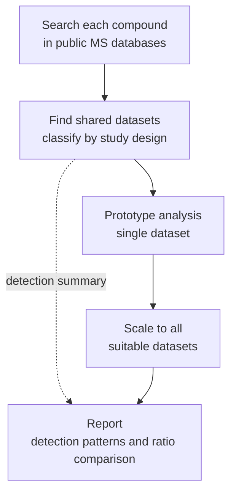

# Reverse Metabolomics — Omeprazole / 5-hydroxyomeprazole

A post-MASST targeted MS1 refinement workflow built on the
[RforMassSpectrometry](https://www.rformassspectrometry.org/) ecosystem.

The novel contribution is a **parent–metabolite ratio analysis**: rather
than reporting where a compound is detected, the pipeline quantifies how
the omeprazole / 5-hydroxyomeprazole balance shifts across public
datasets — a proxy for CYP2C19 activity at population scale.

## Pipeline overview



## MASST searches

| compound | GNPS2 session | hits (datasets) |
|---|---|---|
| omeprazole | `2399487d18d6` | 762 rows · 53 datasets |
| 5-hydroxyomeprazole | `4c9e1b910599` | 311 rows · 30 datasets |
| **intersection** | — | **26 datasets** |

Settings: cosine ≥ 0.7, matched peaks ≥ 3, analog search off, both
polarities.

## Repository structure

| file | description |
|---|---|
| `reverse-metabolomics-workflow.qmd` | Part 1 — dataset selection + single-dataset prototype |
| `all-datasets-analysis.qmd` | Part 2 — scaling to all Tier-B datasets |
| `Omeoprazole.csv` | MASST export for omeprazole |
| `5-hydroxyomeprazole.csv` | MASST export for 5-hydroxyomeprazole |
| `dataset_plan.csv` | generated by Part 1 — one row per D_both dataset with tier |

## Key concepts

**Tiers (datasets in D_both)**

- **Tier A** — no comparative design; contributes to presence/absence only.
- **Tier B** — ≥ 2 health-status groups with ≥ 5 hits per compound per
  arm; full ratio analysis.
- **Tier C** — HILIC or incompatible chromatography; skipped.

**Confidence tiers (per sample, per compound)**

- **Tier 1** — MS2 confirmed by RuSirius + COSMIC, plus MS1 peak.
- **Tier 2** — MS1 peak only (DDA stochasticity miss).
- **Tier 3** — no peak above noise (informative zero).

## Dependencies

```r
BiocManager::install(c("Spectra", "MsBackendMassIVE", "xcms", "MsCoreUtils"))
install.packages(c("dplyr", "tidyr", "ggplot2"))
remotes::install_github("<your-org>/RuSirius")   # in review at JOSS
```

## How to run

1. Render `reverse-metabolomics-workflow.qmd` — inspects `dataset_plan.csv`
   and runs the single-dataset prototype.
2. Set `dataset_proto` in that document after reviewing the plan.
3. Render `all-datasets-analysis.qmd` to scale across all Tier-B
   datasets and produce the paper figures.
