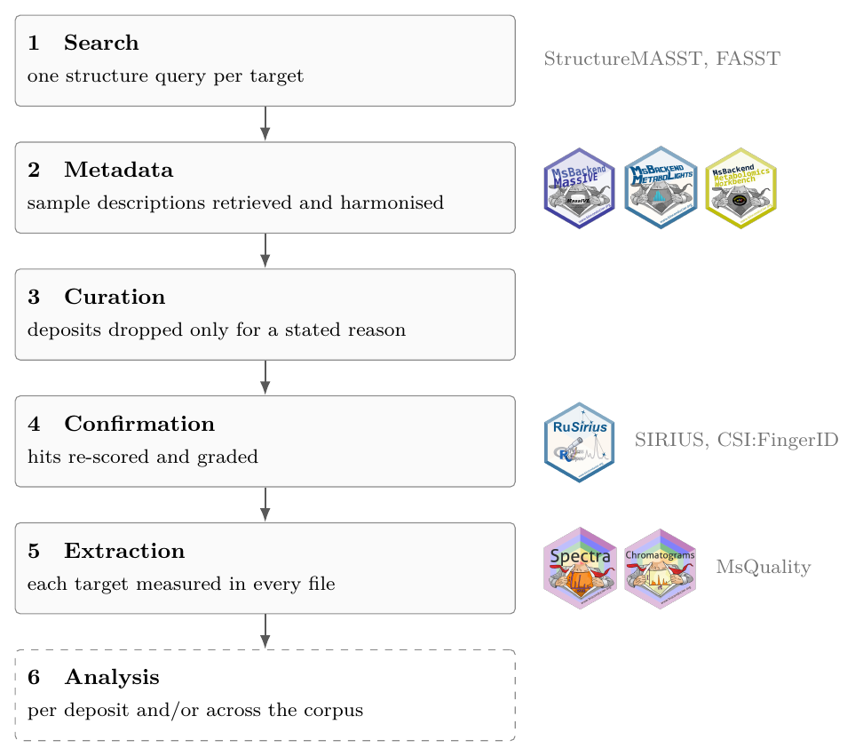

# Reverse Metabolomics: a generic reanalysis workflow for public LC-MS/MS data

A reproducible workflow for reanalysing public LC-MS/MS data at scale, built on the
[RforMassSpectrometry](https://www.rformassspectrometry.org/) packages. It takes one or
more target compounds, finds them across public deposits by spectral library search,
confirms each hit with SIRIUS, and then measures the confirmed compounds at MS1 in every
biological file of every confirmed assay, including the files where the instrument never
fragmented them.

Two applications ship with it, under `application/`, each with a pair of targets:

| application | pair | question |
|---|---|---|
| `omeprazole` | omeprazole / 5-hydroxyomeprazole (exogenous) | CYP2C19 metaboliser activity: a genotyped, dosed cohort as ground truth, then the ratio in blood across the other deposits |
| `kyn-trp` | L-tryptophan / L-kynurenine (endogenous) | the kynurenine/tryptophan ratio against age in adult plasma and serum, across cohorts |



*The workflow. Steps 1 to 5 are the same for every application; step 6 is where an
application asks its own question. Hexes mark the packages developed in the thesis,
and grey names the external tools a step calls.*

Each step is one Quarto notebook in `application/<name>/`:

| step | notebook | what it does |
|---|---|---|
| 1 Search | `01-search.qmd` | finds each target's library spectra in FASSTrecords and their matches in public deposits (cosine at least 0.7 over at least 3 peaks), sets aside library spectra whose precursor m/z fits no ion of the target, and keeps the deposits with a hit for every target |
| 2 Metadata | `02-metadata.qmd` | removes the deposits whose ReDU record already rules them out, retrieves each deposit's sample metadata (MassIVE: Pan-ReDU and the submitter's own table; MetaboLights: ISA-Tab; Metabolomics Workbench: mwTab), maps it onto common fields and assigns each hit to its assay |
| 3 Curation | `03-curation.qmd` | removes the deposits that cannot answer the question, each with its reason, and keeps the assays with a hit for every target |
| 4 Confirmation | `04-confirmation.qmd`, `confirmation/*.qmd` | re-scores every hit with SIRIUS and CSI:FingerID, keeps the assays where every target is confirmed, and sets per assay and target the ion, m/z, retention-time range and m/z tolerance step 5 uses |
| 5 Extraction | `05-extraction.qmd` | measures each target at MS1 in every biological file of each confirmed assay: one row per file with each target's detection and peak area |
| 6 Analysis | `06-analysis.qmd` | the application's own question, one value per subject and matrix |

`05-extraction.qmd` and the three confirmation notebooks are identical in the two
applications; steps 1 to 4 differ only in the parts specific to each application, and
step 6 is written for each. Omeprazole has one more notebook, `_05-probe-checks.qmd`,
a child of `05-extraction.qmd` that checks the extraction choices on the dosed cohort.

## Setup

1. **R and packages.** R 4.6 with Bioconductor 3.23, Quarto 1.5 or later, and the
   packages listed under [Dependencies](#dependencies). Steps 1 to 5 check the
   pinned versions when they start (`R/setup.R`).
2. **SIRIUS** 6.3 or later on the `PATH`: step 4 calls it through `RuSirius`. Log in
   once through the SIRIUS GUI; the notebooks use the login it caches.
3. **FASSTrecords.** Download `masst_records.zip` (42.6 GB) from Zenodo,
   [doi:10.5281/zenodo.18199544](https://doi.org/10.5281/zenodo.18199544), and
   unzip it on a disk with room for the database it holds, `masst_records.sqlite`
   (about 141 GB). Tell R where it is in `~/.Renviron`:

   ```
   FASST_DB=/path/to/masst_records.sqlite
   ```

4. **Disk space for the raw files.** The SIRIUS runs and steps 4 and 5 download the raw
   files of the assays they read through the `MsBackend` packages, into one
   BiocFileCache.

## Running it

Work from an application's folder and render the steps in order, one at a time:

```r
setwd("application/kyn-trp")   # or application/omeprazole

quarto::quarto_render("01-search.qmd")
quarto::quarto_render("02-metadata.qmd")
quarto::quarto_render("03-curation.qmd")
# The SIRIUS runs: on a fresh clone, or after steps 1-3 change, render step 4 with
#   quarto render 04-confirmation.qmd -P run_confirmations:true
quarto::quarto_render("04-confirmation.qmd")
quarto::quarto_render("05-extraction.qmd")
quarto::quarto_render("06-analysis.qmd")
```

Or from the repository root, retrying when a repository does not answer:

```bash
bash bench/rerun.sh kyn-trp 01 02 03 massive metabolights workbench 04 05 06
```

Leave out `massive metabolights workbench` to reuse existing SIRIUS results; with no
stage named, `rerun.sh` renders `04 05 06`. Render one notebook at a time: the raw files
go into one BiocFileCache, which takes one writer at a time.

## What is in the repository

| path | what it is |
|---|---|
| `application/<name>/*.qmd`, `confirmation/` | the notebooks of the six steps |
| `application/<name>/compound.csv` | the targets: role, name, formula, [M+H]+ m/z, first block of the InChIKey and, optionally, an isomer that elutes at another target's retention time |
| `application/<name>/curation/` | the hand corrections and checks of step 5 (see below) |
| `application/<name>/dataset_metadata/` | the metadata cache of step 2; only the inputs no code can fetch are tracked |
| `R/` | the shared code: `setup.R` (version check, packages, target names), `masst.R` (targets and library search), `metadata.R` (metadata retrieval), `ms1.R` (extraction and peak picking), `analysis.R` (step 6), `peak_review_panels.R` (review plots of the picked peaks) |
| `bench/rerun.sh` | renders the steps of one application, retrying when a repository does not answer |

Everything the code writes is regenerated and not tracked: `artifacts/`,
`StructureMASST_output/` (the FASSTrecords extracts), `results/` and `sirius_projects/`
(SIRIUS), `figures/` and `peaks_review_v2/`.

## Manual decisions

Every decision made by hand is in the repository, so the results can be reproduced:

- **In the notebooks,** marked *Manual work*: in step 2 the deposits removed or
  completed by hand, the Workbench file order, the constants and column maps, and the
  related deposits; in step 3 the deposits excluded by hand and, in kyn-trp, one
  deposit's stray hits; in step 4 the assays set aside (`SET_ASIDE`); in kyn-trp's
  step 6 the rule for the sleep study.
- **In `curation/`**, read by step 5:

  | file | what it records |
  |---|---|
  | `ms1_drop_list.csv` | peaks to drop, with the reason |
  | `ms1_accept_list.csv` | peaks to accept at a given apex, with the reason; the peak criteria still apply |
  | `rt_apex_overrides.csv` | the MS1 apex to anchor the window on where a confirmed spectrum points to the wrong peak |
  | `tolerance_check.csv` | the assays extracted once more at the wider time-of-flight tolerance |

- **In `dataset_metadata/`:** the metadata obtained by hand for omeprazole (Pan-ReDU
  exports, a submitter table, MTBLS12231's ISA-Tab files) and the Metabolomics Workbench
  analysis files step 5 reads (`ST*_AN*.txt`).

## Dependencies

```r
BiocManager::install(c(
  "Spectra", "xcms", "MsCoreUtils", "MsQuality", "MetaboCoreUtils",
  "Chromatograms", "mzR", "BiocFileCache"
))
install.packages(c("dplyr", "tidyr", "ggplot2", "jsonlite", "curl", "readxl",
                   "RSQLite", "patchwork"))
remotes::install_github("RforMassSpectrometry/RuSirius@v1.0.4")
# The gabri branches keep the assay in the cached file name, so a deposit's
# positive- and negative-mode files with the same name do not overwrite each other.
remotes::install_github("RforMassSpectrometry/MsBackendMassIVE@gabri")
remotes::install_github("RforMassSpectrometry/MsBackendMetaboLights@gabri")
remotes::install_github("RforMassSpectrometry/MsBackendMetabolomicsWorkbench")
```

`R/setup.R` checks:

| package | version |
|---|---|
| RuSirius | exactly 1.0.4 |
| MsBackendMassIVE | ≥ 0.99.1 |
| MsBackendMetaboLights | ≥ 1.7.4 |
| MsBackendMetabolomicsWorkbench | ≥ 0.99.0 |
| Chromatograms | ≥ 1.3.3 |
| SIRIUS binary | ≥ 6.3 |

## Licence and citation

The code is released under the **Apache License 2.0** (see [`LICENSE`](LICENSE)). The
public mass-spectrometry data it reanalyses remain under the terms set by each
depositor. To cite the workflow, use [`CITATION.cff`](CITATION.cff).
